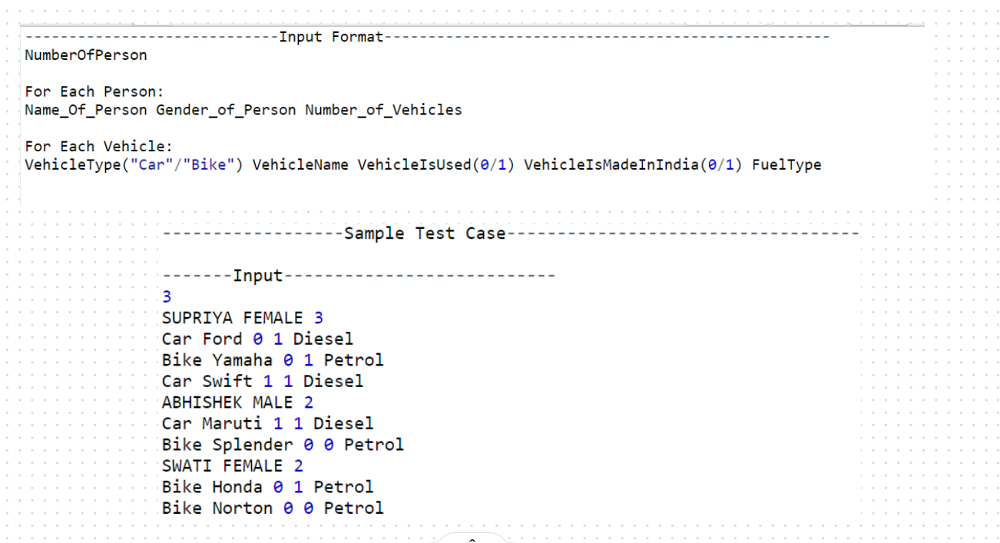

# Vehicle Management System

Vehicle Management System is used to store the details of Person with their Vehicles details.

This is demonstration of Object Oriented Programming and their features using Code.

## FLOWCHART

## +Public data members or member functions
## -Private data members or member functions
## +-Protected data members or member functions

# There are Four classes:
* # Vehicle
* # Car (Inherit Vehicle class)
* # Bike (Inherit Vehicle class)
* # Person

# Features of OOPS present in the code

### Inheritance

### Polymorphism

### Encapsulation

### Data Abstraction

# Complete Code

##### Sample Test 

